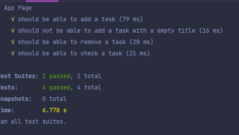

# Desafio cumprido

### Comentários sobre a solução e bonus
- Foi utilizado uma estratégia de sequence no lugar de "números aleatórios", com a intenção de não repetir os valores, causando problemas futuros.
- Como extra, implementei a inserção pelo botão "enter", sem a necessidade de clicar no botão, a fim de tornar a ferramenta mais rápida e fácil de utilizar.
